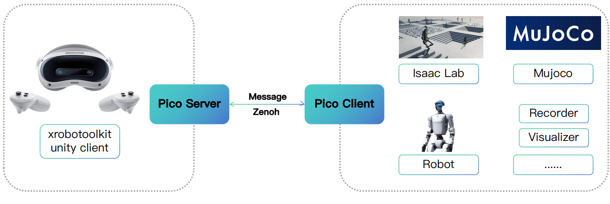

<h1 align="center">🌌 FlexTele: Flexible Teleoperation Pipeline for VR & Robotics</h1>

<p align="center">
    
    
    
</p>

<div align="center">
  <p><i>FlexTele is a flexible, lightweight, modular, and distributed teleoperation pipeline for VR and robotics.</i></p>
</div>

`FlexTele` is designed around **decoupled modules**, enabling each part of your teleoperation stack (input, mapping, control, visualization, and logging) to evolve independently while communicating through **distributed messaging**.

## ✨ Key Features
* **Lightweight Core**: Minimal dependencies and fast iteration cycle.
* **Decoupled Modular Pipeline**: Replace or upgrade any module without touching the rest.
* **Distributed Communication**: Modules can run on different machines or processes, powered by [Zenoh](https://zenoh.io/) for efficient and scalable data transport.
* **VR Teleoperation Ready**: Built on [Pico](https://www.picoxr.com/global) and [XRobotoolkit](https://xr-robotics.github.io/), enabling robot control through VR interfaces.
* **Dynamic Simulation Recording**: Extends [IsaacLab](https://github.com/isaac-sim/IsaacLab) environments with runtime-controllable recorders, allowing data capture to be enabled or disabled at arbitrary timesteps.

## 🧩 Architecture

<p align="center">
    
</p>

## 🚀 Quick Start

### 1. Clone the repository

```bash
git clone --recursive https://github.com/SCEIRobotics/FlexTele.git
cd FlexTele
```

### 2. Install dependencies

FlexTele supports two runtime roles depending on deployment:

- **Pico Server** → runs on robot / workstation / control node  
- **Pico Client** → runs on VR device host machine  

Please install dependencies according to your role.

#### 🖥️ Pico Server Environment

Used for:
- Read and preprocess data from Pico devices
- Seed pico data to client

Needed:
- Ubuntu 22.04/24.04 or Nvidia Jetson

```bash
uv pip install -e .[pico-server]
```

```bash
bash script/install_xrobotoolkit.sh
```

#### 🖥️ Pico Client Environment

Used for:
- Receive pico data from server

```bash
uv pip install -e .[pico-client]
```

### 3. Run Isaaclab Teleoperation

#### ➡️ Isaaclab Machine

```bash
cd example/isaac_env/isaac_g1_factory_demo/source/isaac_g1_factory_demo
uv pip install -e .
```

```bash
cd example/isaac_env/isaac_g1_factory_demo/teleoperation
bash record.sh
```

#### ➡️ Pico Server Machine

Start xrobotoolkit service

```bash
cd /opt/apps/roboticsservice
./runService.sh
```

Start Flextele Pico Server

```bash
python script/start_pico_server.py
```

#### ➡️ Pico VR

Open XRoboToolkit-Unity-Client app, and click send data.

## 🗺️ Roadmap
- [x] Release pico server and client
- [x] Release isaaclab teleoperation example with runtime-controllable recorders
- [ ] Support mujoco and more robots

## 🙌 Acknowledgements
This project is built upon the following excellent works:

- [IsaacLab](https://github.com/isaac-sim/IsaacLab)
- [XRobotoolkit](https://xr-robotics.github.io/)
- [Zenoh](https://zenoh.io/)

## 🐼 Core Contributors

Jing He([GitHub](https://github.com/rivergold)), Chen Xing([GitHub](https://github.com/KongCDY))

Sichuan Embodied Intelligence Robot Training Base

## 📄 License
This project is released under the MIT License. See the [LICENSE](./LICENSE) file for details.
